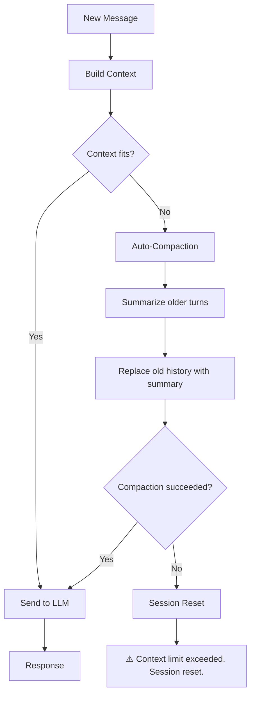

> ⚠️ **Heads up:** This analysis is based on [OpenClaw's codebase](https://github.com/openclaw/openclaw) as of **March 7, 2026**. This is an actively developed project, so things might have changed by the time you read this. Always check the source!

A few days ago I saw [this tweet from @levelsio](https://x.com/levelsio/status/2029761803769594232) where he describes his experience running OpenClaw for over a month. The part that really got me thinking was this:

> "just the best LLM experience on Telegram now, better than the LLM apps, also helps it just is a continuous convo going on forever"

A continuous conversation going on **forever**. Think about how different that is from what most of us do with LLMs. You open ChatGPT, ask something, close it, maybe start a new chat next time. OpenClaw is more like a persistent companion that just... remembers and keeps going.

That got me curious. LLMs have finite context windows. So how do you actually manage context in a conversation that never ends?

I'm currently building a flight deals bot on Telegram (more on that in a future post), and my architecture is way more isolated, one session per user, scoped interactions. But I wanted to learn from how OpenClaw handles this at a bigger scale.

So I went into the codebase.

## The Fundamental Separation

The first thing that clicked for me is that OpenClaw separates the interface layer (where messages come from, Telegram, CLI, whatever) from the assistant runtime (where the actual intelligence lives).

The LLM provides the intelligence. OpenClaw provides the operating system around it.

Your Telegram channel, your CLI, your web UI, those are just transports. The session logic, context management, and memory all live independently from how the user sends their message.

## How the system prompt is built (every single turn)

This was the most surprising part for me. The system prompt in OpenClaw is not static. It's dynamically rebuilt every single turn.

Every run, `buildAgentSystemPrompt()` assembles a fresh prompt that includes:

- The tool list and configuration
- Skills metadata
- Workspace bootstrap files
- Runtime metadata (time, environment)
- Memory context (when enabled)

The workspace bootstrap files are loaded in a specific order:

```
AGENTS.md → SOUL.md → TOOLS.md → IDENTITY.md → USER.md → HEARTBEAT.md → BOOTSTRAP.md → MEMORY.md
```

Each file is capped at **20,000 characters**, and the total bootstrap injection is capped at **150,000 characters**. Large files get truncated and the model is warned about it.

```typescript
// From src/agents/pi-embedded-helpers/bootstrap.ts
export const DEFAULT_BOOTSTRAP_MAX_CHARS = 20_000;
export const DEFAULT_BOOTSTRAP_TOTAL_MAX_CHARS = 150_000;
```

These are configurable. The point is: if you're building an agent, don't treat your system prompt as a static string you set once. Regenerate it each turn so it reflects the current state.

## Session storage architecture

OpenClaw separates session data into three concerns:

| What                 | How                             | Where                                                |
| -------------------- | ------------------------------- | ---------------------------------------------------- |
| Session metadata     | JSON key/value store            | `~/.openclaw/agents/<id>/sessions/sessions.json`     |
| Conversation history | Append-only JSONL transcripts   | `~/.openclaw/agents/<id>/sessions/<sessionId>.jsonl` |
| Long-term memory     | SQLite with vector + FTS search | `~/.openclaw/agents/<id>/memory/`                    |

The JSONL transcripts are not flat logs. Each entry has an `id` and `parentId`, forming a tree structure. Conversations can branch, which makes sense for an agent that might take multiple paths or retry actions.

The SQLite database is used for semantic search over memory files (like `MEMORY.md`). It stores chunked and embedded content that the agent can query when it needs to recall something. It doesn't store raw chat history, that stays in the JSONL files.

For my flight bot, I'm keeping it simpler: each `chat_id` maps to an in-memory session. But if I ever need persistence, the JSONL-per-session pattern works well.

## Context overflow and compaction

OK this is the part I found most interesting. When a conversation runs "forever," you will hit the context window limit. That's not an edge case, it's guaranteed. Here's how OpenClaw deals with it:



During normal operation, the full conversation history is sent to the LLM each turn. Nothing special.

When `contextTokens > contextWindow - reserveTokens` (reserve defaults to ~16K-20K tokens), OpenClaw triggers auto-compaction. The model summarizes older conversation turns and the summary replaces the original messages. The run resumes with a smaller context.

If compaction itself fails (because even the summarization hits the context limit), OpenClaw gives up on the current session, generates a new session ID, and tells the user:

> "⚠️ Context limit exceeded during compaction. I've reset our conversation to start fresh."

The user loses some history, but the conversation continues. It doesn't crash. For a "never-ending" conversation, this matters a lot.

## Long-term memory vs. in-session history

OpenClaw separates two types of memory:

- Short-term = the `.jsonl` transcript sent each turn (what the LLM can "see")
- Long-term = SQLite index that the agent queries selectively and injects into context when relevant

The minimum viable agent memory is just: write durable notes somewhere outside the context window. Whether you use BM25, vector search, SQLite, or a plain file is an implementation detail.

For my bot, I'm starting with a `memory` string per user that gets injected into the system prompt. If that's not enough, I'll move to SQLite. Same principle, less infrastructure.

## What I'm taking from this

I'm not building OpenClaw. My flight bot has a completely different scope, isolated per-user sessions, no shared group chats, no heartbeat loops. But some of these patterns translate directly:

| OpenClaw                        | My flight bot                                           |
| ------------------------------- | ------------------------------------------------------- |
| Session key per agent           | `chat_id` as session key                                |
| `.jsonl` transcript per session | In-memory list (Redis if I need persistence)            |
| Dynamic system prompt rebuild   | Regenerate system message each turn                     |
| Compaction on context overflow  | Call LLM to summarize when approaching token limit      |
| SQLite long-term memory         | A `memory` string per user, injected into system prompt |

The "always-on loop" that makes OpenClaw feel like a persistent companion? For a Q&A bot, you don't need it. The Telegram webhook handler is your loop. Event-driven, not polling.

## Wrapping up

What levelsio described, a continuous conversation that just keeps going, isn't magic. It's context management that knows when to summarize and when to start fresh. The LLM doesn't have infinite memory. OpenClaw just makes it feel like it does.

If you're building a long-running agent, plan for context overflow from day one. Rebuild your system prompt each turn. Keep long-term memory outside the context window. And separate your transport from your runtime, because Telegram, Slack, or CLI are just delivery mechanisms.

The code is open source. Go read it: [github.com/openclaw/openclaw](https://github.com/openclaw/openclaw)

---

References:

- [@levelsio on his OpenClaw experience](https://x.com/levelsio/status/2029761803769594232)
- [OpenClaw GitHub Repository](https://github.com/openclaw/openclaw)
- [OpenClaw Session Management & Compaction Docs](https://github.com/openclaw/openclaw/blob/main/docs/reference/session-management-compaction.md)
