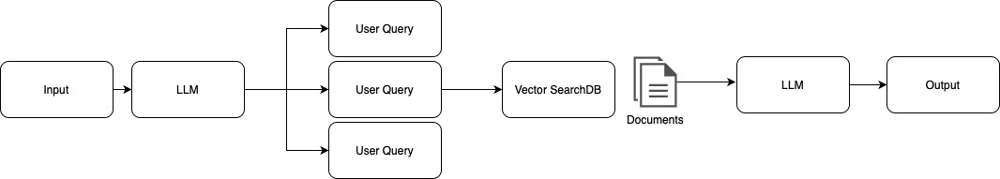

In this article, we explore effective strategies for integrating vector databases with large language models (LLMs). Learn about the latest techniques in similarity search, contextual compression, and more, to enhance how your systems process and retrieve documents for relevant answers. This small guide is ideal for developers and technologists looking to update their AI applications.

## Vector Search

This is the nave approach where we use a method called similarity search to retrieve documents from a vector database. Once we have obtained the documents, we feed them into a large language model (LLM) to produce results

### Issues

- Large doc chunks reduce the quality of the retrieval process
- Limited context relevance
- Bad retrievals or return irrelevant chunks

## Contextual Compression

We use a vector database to find documents, and before giving them to the large language model (LLM), we can take one or both actions:

1. Tell the LLM to remove documents that are not relevant
2. Only retrieve the most similar documents by filtering the relevance score

## Rewrite, Retrieve and Read

Basically in this approach, we ask the LLM to rewrite the user query, it will generate better results since the LLM is so good at understanding purposes and meanings

## Retrieval with Reranking

Pass a bigger number of documents to the Reranker, which is an LLM that takes the query and the documents and returns a relevance score to filter out documents

### Parent Document retrieval

Fix the issue when your query is in the middle of 2 chunks of documents stored in the vector db. In this case, we combine multiple contiguous chunks related to the most relevant chunk to give the LLM full context to answer the query, it will depend on how we are splitting our chunks.

Reference:

- [RAGOps: Advanced Retrieval Strategies with LangChain, Langsmith and Supabase.](https://www.youtube.com/watch?v=EuHderGVUs8)
- [Query Rewriting for Retrieval-Augmented Large Language Models](ERReadad)
- [Cohere Rerank](https://cohere.com/rerank)
- [Parent Document Retriever](https://python.langchain.com/docs/modules/data_connection/retrievers/parent_document_retriever/)
